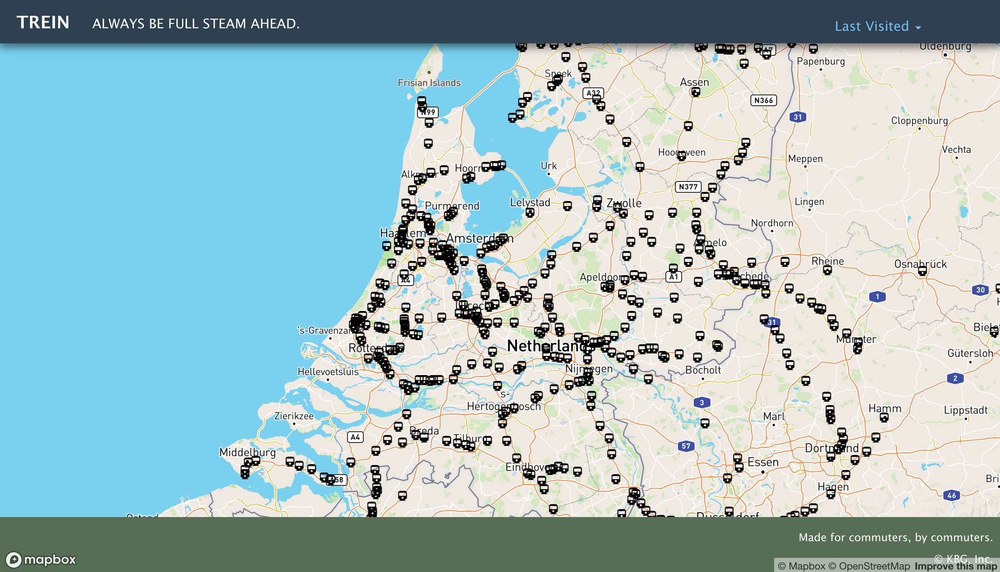
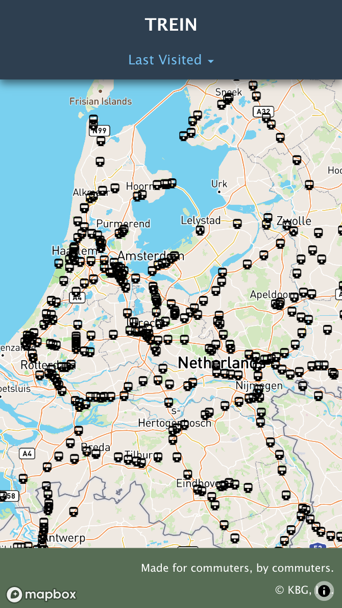

# Trein
### Always be full steam ahead.

  

## Description

Goedendag! [Trein](https://kjwesthoff.github.io/GroupChallenge1/) is a desktop and mobile friendly application for commuters in the Netherlands, whether local or visiting, to be able to find trains around them. 

As commuters ourselves, we thought it important to simplify a search to just one application. Without all the other distractions that some applications may provide, Trein keeps its interface minimal by  providing a fullscreen map, containing station checkpoints with information of arriving trains, in order for a quick and easy interaction by the user. 

Below is our user story that helped guide the development process.
 
# Problem Statement

### **AS A** commuter in the Netherlands,
### **I WANT** to see nearby trains, their arrival times, and the train features.
### -------------------------------------------
### **GIVEN** A moblile-friendly application,
### **WHEN** I click on a station on the map (in the Netherlands),
### **THEN** I get a list of trains arriving, and that station is added to my Last Visited list.  
### **WHEN** I choose a train,
### **THEN** I get a picture of the train, the train's arrival time, and the train car features. 
### **WHEN** I frequently select a specific station,
### **THEN** it will be saved to my favorites list.
### -------------------------------------------
## The application uses the Dutch National Rail company [(NS API)](https://www.ns.nl/en/travel-information/ns-api) API to find train information, and the [Mapbox API](https://www.mapbox.com/) for location specifications.

# Function
As stated before in the Problem Statement, the application's functionality is quite simple.

**Train Stations**

* Immediately when the application is loaded, the user will see a map centered on the Netherlands.
* On the map, there will be train icons placed in various locations, which indicate a train station is at that specific location.
* When a specific train station is clicked, the user will then be prompted with a pop-up, listing all the trains that will arrive at that station, depending the current time. 

**Last Visited Tab**

* At the top right of the menu (desktop), or bottom center of the menu (mobile), the user will also notice a "Last Visited" tab. 
* This tab will add the five most recently clicked stations into a list, and will be saved. 
* If the user refreshes the page, the five most current stations will still be in the list, and the user can click an item on the list. 
* Once one of the locations is clicked from the "Last Visted" list, the map will then transition the user to that specified location.

**Train Details**

* As mentioned, when a certain train station is clicked, a list of trains arriving to that station will appear.
* When the user clicks on a train from that list, a modal will appear, displaying an image of the specific train, and certain train details, as well as the arrival time.

*Disclaimer*
* Being that the Netherlands has a time difference, users in the US may not be prompted with trains depending on the time of day they are using the application. If that is the case, the Amsterdam area usually has trains running at most times of the day.

# Future Development

In future development, we hope to expand what the user will be able to do. 
* We would like to broaden to train stations to cover other neighboring countries in europe and get the train data from those locations. 
* As well as, we will impliment a features button in the selected train modal, so that the user will be able to see whether the train has a toilet, wifi, a restaurant, or any other spec.

# Technologies Used 

* HTML

* CSS 

* JavaScript

* [jQuery](https://jquery.com/)

* [Moment.js](https://momentjs.com/)

* [Foundation](https://get.foundation/index.html)

* [Pure CSS](https://purecss.io/)

* Third Party APIs 
    
    * [Mapbox API](https://www.mapbox.com/)
    
    * [NS API](https://www.ns.nl/en/travel-information/ns-api)

# Contributors

* Bennett Collier:
    https://github.com/bennettcollier

* Gustavo Morales:
    https://github.com/gusmor94

* Karl-Johan Westhoff:
     https://github.com/KJWesthoff